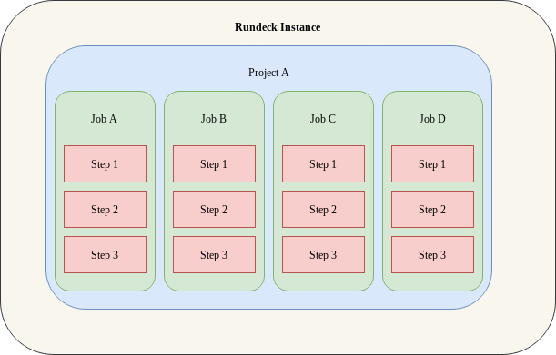

# Step 1

Get a single job running on a VM




Common example: Install ssh on Ubuntu 24.4.01 (As it's not on by default)


Typical steps:

```bash
sudo apt upgrade
sudo apt update --fix-missing
sudo apt install ssh -y
```

### TODO Windows example

Translation of Win/MacOS/Linux agnostic jobs

Server restart

Disk scanning

Backups

Renaming LVMs

Disk space report

DB startup and shutdown

Remounting volumes

Batch jobs

Environment promotion (dev -> UAT -> Prod)

Complaince checks

Agent checks (Splunk, dd-agent, Puppet, CloudWatch)